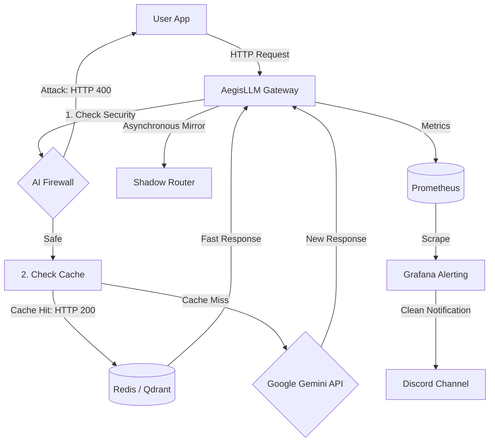
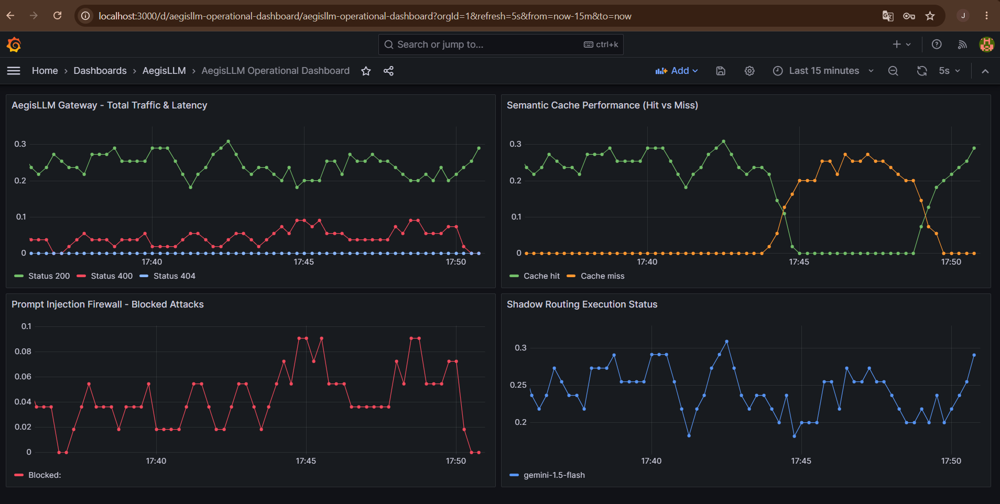
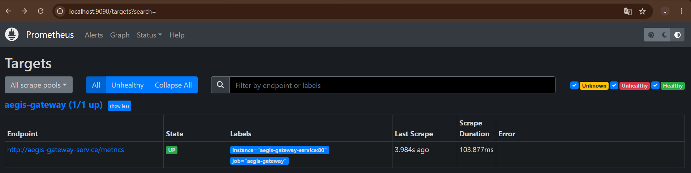
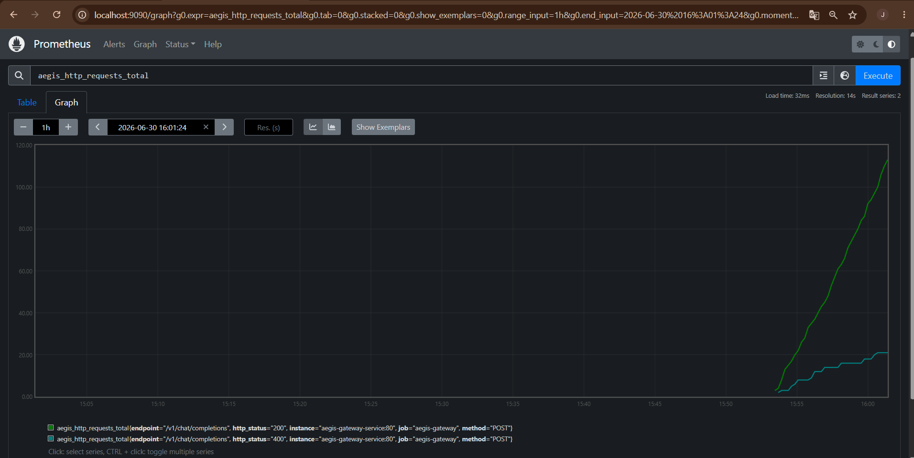
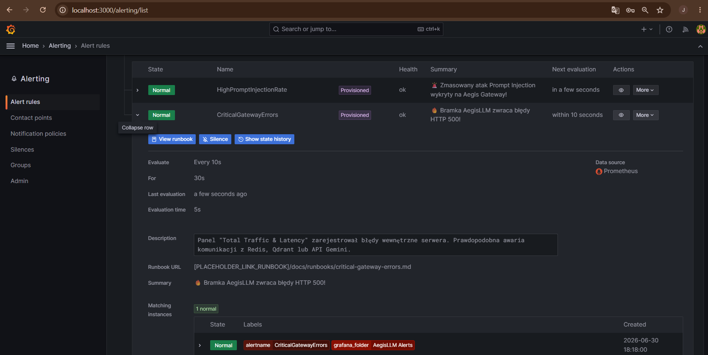
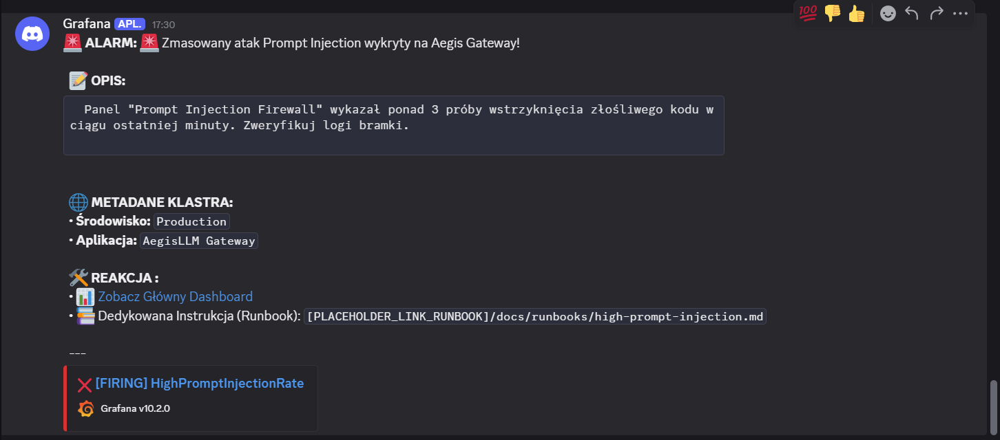

# AegisLLM: AI Security Gateway & Monitoring

A lightweight API gateway designed to protect and speed up applications using LLMs (like Google Gemini). It acts as a reverse proxy that blocks Prompt Injection attacks, caches similar questions to save money, and sends clean alerts directly to Discord when something goes wrong.

[](https://github.com/Bronski05/AegisLLM-Gateway/actions/workflows/ci.yml)


## Pipeline Steps

AI Firewall: Every incoming prompt is inspected before it reaches the LLM. If an attack (Prompt Injection) is detected, the gateway blocks it immediately, returns an HTTP 400 error, and increments a Prometheus counter.

Semantic Caching: Safe prompts are checked against a vector database (Qdrant) and Redis. If a semantically similar question was asked before, the answer is served instantly from the cache, saving API costs and reducing latency.

Shadow Routing: For every cache hit, the gateway asynchronously mirrors the request to a backup model or eval pipeline via a background task, without slowing down the user.

GitOps Alerting & Fallbacks: Prometheus metrics track all traffic statuses (200/400/500). The alert queries use fallback logic (or vector(0)) so the system knows that 0 errors is the normal state and doesn't trigger false alarms.

Clean Discord Alerts: Alert routing and layout are managed as code in Helm values. When a threshold is breached (e.g., >3 attacks/min), Grafana sends a well-formatted message to Discord with the incident details and a link to the dashboard.


## Quick Start

Prerequisites
Kubernetes Cluster (Kind or Minikube),
Helm v3,
PowerShell (to run the automation script)

Configure Environment

Create a .env file in the root directory:

GEMINI_API_KEY=your_actual_gemini_api_key_here

## Deployment

Deploy the entire microservice architecture using the automated management script:

```Bash
.\run.ps1 up
```

Expose the gateway and monitoring endpoints to your localhost:

```Bash
.\run.ps1 proxy
```

Accessing Dashboards

Grafana: http://localhost:3000 (Path: /d/aegisllm-operational-dashboard)
Prometheus (Metrics Gateway): http://localhost:9090
Alertmanager (Alert Core): http://localhost:9093

### 📸 Live Telemetry & System Proof

Here is how the architecture behaves under real-time simulated traffic and chaos tests:

#### 1. Grafana Dashboard (Resilience & Fail-Safe Test)
*This view shows what happened when the Redis cache deployment was scaled down to 0 replicas. The gateway did not crash with HTTP 500 errors. Instead, the fail-safe kicked in, treated the failure as a continuous Cache Miss (the orange line spikes), and kept routing traffic safely to the Gemini API without dropping a single request.*



#### 2. Prometheus Target Status & Collected Metrics
*Proof that Prometheus is successfully scraping data inside the Kubernetes cluster. The target endpoint shows a healthy 'UP' status, and the metric graph actively counts incoming requests split by HTTP 200 (safe traffic) and HTTP 400 (blocked injection attacks).*




#### 3. Active Alert Rules in Grafana
*Confirmation that automated alerting is configured as code. The system constantly monitors for both infrastructure crashes (`CriticalGatewayErrors` for HTTP 500s) and active security threats (`HighPromptInjectionRate`) every 10 seconds.*



#### 4. Live Discord Notification Instance
*An example of the actual alert message sent to the Discord channel when a threat threshold is breached. 



## Running Automated Tests
The project includes a pytest suite validating the async gateway lifecycle, firewall blocks, and ensures Prometheus metrics are correctly incremented during failures:

```Bash
python -m pytest test_main.py -v
```

## CI/CD Integration (GitHub Actions)

The pipeline automates quality checks on every push or pull_request:

Linting: Code style check using ruff.

Helm Validation: Runs helm lint to check for syntax errors or bad indentation in the Kubernetes manifests and alert configs.

Telemetry Testing: Runs pytest to ensure that application blocks and database crashes correctly trigger Prometheus metric updates.

Docker Promotion: If all tests pass, the multi-stage Docker build runs, and the image is pushed to GitHub Container Registry (GHCR).

## Limitations & Trade-offs

Data Privacy (DLP): Currently, prompts pass through an external cloud API (Gemini). In a true enterprise banking environment, strict Data Loss Prevention policies would require replacing this with a locally hosted LLM (e.g., Llama 3) running strictly on-premise.

Cache Accuracy: Finding the right similarity threshold in Qdrant is tricky. Too low causes false cache hits (wrong answers), too high reduces cost savings.

Ephemeral Storage: Redis and Qdrant currently use local volume mounts for demo purposes. For production, they need Persistent Volume Claims (PVC) to prevent data loss when pods restart.