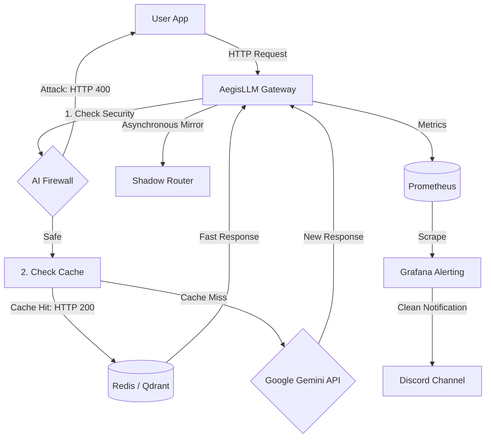

# AegisLLM: AI Security Gateway & Monitoring

A lightweight API gateway for LLM-based applications (e.g. Google Gemini). It acts as a reverse proxy that adds prompt injection filtering, semantic caching, and basic observability with Prometheus and Discord alerts.

[](https://github.com/Bronski05/AegisLLM-Gateway/actions/workflows/ci.yml)


## Pipeline Steps

- **AI Firewall** – each incoming request is checked for prompt injection before it reaches the LLM. If a match is detected, the request is blocked and an HTTP 400 response is returned. A Prometheus counter is incremented.
- **Semantic caching** – requests are matched against stored embeddings in Qdrant (with Redis as a fast lookup layer). If a similar query is found, the cached response is returned.
- **Shadow routing** – requests are asynchronously mirrored to a secondary endpoint for evaluation/testing purposes. This runs in the background and does not affect the main response path.
- **Metrics & alerting** – Prometheus collects request-level metrics (200/400/500). Alerts are based on threshold rules defined in the monitoring stack.
- **Notifications (Discord)** – when alert conditions are triggered, Grafana sends a formatted message to a Discord webhook with basic incident details and a dashboard link.


## Infrastructure as Code (IaC)

The local Kubernetes cluster is provisioned using Terraform. All configuration is stored in the `terraform/` directory.

- **providers.tf** – defines Terraform version requirements and configures the `kind` provider.
- **main.tf** – creates a multi-node Kubernetes cluster (`aegis-production-cluster`) with:
  - a control-plane node exposed to localhost on ports 80 and 443
  - a worker node for application and database workloads
- **Outputs** – exports the generated kubeconfig path to `~/.kube/config`.


##  Helm Chart Architecture (`aegisllm-chart/`)

 The Kubernetes stack is defined using Helm templates in the templates/ directory.

- **gateway.yaml** – deployment and service for the FastAPI gateway (AegisLLM).
- **redis.yaml, qdrant.yaml** – in-cluster storage for caching and vector search.
- **prometheus.yaml, grafana.yaml** – observability stack with metrics collection and alerting rules.
- **traffic-generator.yaml** – workload generator that simulates normal traffic and prompt injection attacks for testing the system.

## Quick Start

Prerequisites:
Docker Desktop,
Terraform (>= 1.0),
Helm v3,
PowerShell (to run the automation script)

Configure Environment

Create a .env file in the root directory:

GEMINI_API_KEY=your_actual_gemini_api_key_here

## Deployment

Deploy the entire microservice architecture using the automated management script:

### Step 1: Initialize and apply Terraform infrastructure blueprint

```bash
cd terraform/
terraform init
terraform apply -auto-approve
cd ..
```

### Step 2: Spin up the Kubernetes workloads via Helm using PowerShell script
```bash
.\run.ps1 up
```

### Step 3: Expose the gateway and monitoring endpoints to localhost
```bash
.\run.ps1 proxy
```

Accessing Dashboards

* **Grafana:** http://localhost:3000 (Dashboard path: `/d/aegisllm-operational-dashboard`)
* **Prometheus:** Run on port `9090`
* **Alertmanager:** Run on port `9093`

### 📸 Live Telemetry & System Proof

Here is how the architecture behaves under real-time simulated traffic and chaos tests:

#### 1. Grafana Dashboard 

Redis was scaled to 0 replicas. Requests fell back to cache-miss mode and were routed to Gemini without errors.


#### 2. Prometheus Target Status & Metrics
Prometheus scraping is working. Targets are UP, with traffic split between HTTP 200 and 400.


#### 3. Alert Rules in Grafana
Grafana alerting is configured as code, monitoring HTTP 500 errors and prompt injection rate on a 10s interval.


#### 4. Live Discord Notification Instance
Alert message sent to the Discord channel when a threat threshold is breached. 


## Running Automated Tests
The project includes a pytest suite that covers the main gateway flows, including request handling, firewall blocking, and Prometheus metrics updates.

```Bash
python -m pytest test_main.py -v
```

## CI/CD (GitHub Actions)

Every push and pull request triggers a CI pipeline that validates the basic quality and stability of the system.

- **Linting (ruff)** – checks Python code style and catches simple issues early.
- **Helm lint** – validates Kubernetes manifests and ensures the Helm chart is syntactically correct.
- **Tests (pytest)** – runs integration tests covering gateway logic (cache, firewall, Prometheus metrics).
- **Docker build & publish** – builds a multi-stage image and pushes it to GitHub Container Registry (GHCR) if all checks pass.

## Limitations & Trade-offs

- **Data privacy (DLP)** – prompts are currently sent to an external API (Gemini). In a stricter environment, this would need to be replaced with a self-hosted model running on-premise.
- **Cache accuracy** – choosing a similarity threshold in Qdrant is a trade-off. Lower values increase cache hits but risk incorrect matches, while higher values reduce efficiency.
- **Ephemeral storage** – Redis and Qdrant currently use local volumes, which are fine for a demo setup. In production, they should be replaced with persistent storage (PVCs) to avoid data loss on restart.